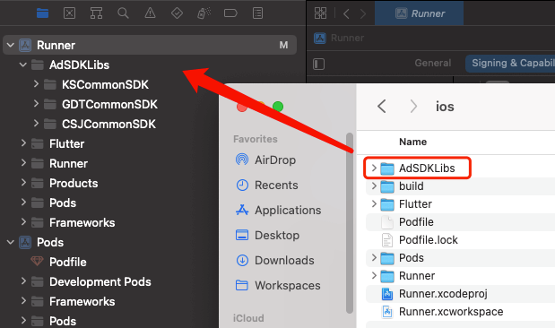
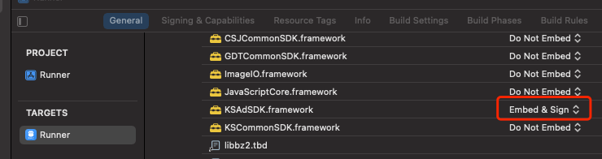
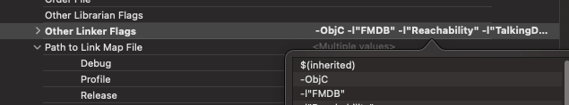

# Flutter JiHuoNiao

Flutter 激活鸟广告插件

> 运行项目中的案例程序时，请先解压 `example/ios/AdSDKLibs/` 下的 Framework 包。

## 接入文档

### 引入广告 SDK

#### Android

1. 引入该 Flutter 插件

2. Gradle 依赖冲突
   应用自身依赖有版本冲突可参考：[Duplicated classes found ](https://stackoverflow.com/questions/56695106/duplicated-classes-found-in-modules-classes-jar)

   ```groovy
   dependencies {
       implementation('com.XXX.XXX:XXX:3.4.0') {
           exclude group: 'com.XXX.XXX', module: 'XXX'
       }
   }
   ```

   应用使用的插件中引入的依赖有版本冲突可参考：

   ```groovy
   android {
     configurations {
       // 去掉激活鸟重复依赖
       all*.exclude module: 'okhttp-3.10.0'
     }
   }
   ```

#### iOS

##### 运行环境

1. iOS 9.0 及以上
2. 编译环境 Xcode 13.3
3. 支持架构：arm64、armv7

##### 引入 Framework 包

1. 将案例程序 `example/ios/AdSDKLibs/` 下的架包引入到自己项目的 `ios` 目录下

2. 将 `AdSDKLibs` 目录直接拖入 `Xcode ` 中，以便自动链接

   

3. 修改快手广告SDK

   'Tagets - General - Frameworks, Libraies...' 下修改快手SDK为 `Embed & Sign` 

   

4. 添加 `-ObjC` 编译配置

   'Tagets - Build Settings - Linking - Other Linker Flags' 添加 `-ObjC` 

   

##### 添加依赖库

'Tagets - Build Phases - Link Binary With Libraries' 添加以下依赖库

<details>
  <summary>点击展开依赖库列表</summary>
Accelerate.framework
AdSupport.framework
AppTrackingTransparency
AudioToolbox.framework
AVFoundation.framework
CoreGraphics.framework
CoreImage.framework
CoreMedia.framework
CoreMotion.framework
CoreTelephony.framework
CoreText.framework
ImageIO.framework
JavaScriptCore.framework
MapKit.framework
MediaPlayer.framework
MobileCoreServices.framework
QuartzCore.framework
Security.framework
StoreKit.framework
SystemConfiguration.framework
UIKit.framework
WebKit.framework
libbz2.tbd
libc++.tbd
libiconv.tbd
libresolv.9.tbd
libsqlite3.tbd
libxml2.tbd
libz.tbd
libc++abi.tbd
</details>

##### 添加权限请求

在 `info.plist` 文件中添加：

1. 允许 HTTP 访问

   ```
   <key>NSAppTransportSecurity</key>
   <dict>
     <key>NSAllowsArbitraryLoads</key>
     <true/>
   </dict>
   ```

2. 位置权限

   ```
   <key>NSLocationWhenInUseUsageDescription</key>
   <string>获取位置信息用于提供个性化推荐</string>
   ```

3. IDFA 权限

   ```
   <key>NSUserTrackingUsageDescription</key>
   <string>获取标识符信息用于个性化推荐</string>
   ```

##### 添加广告归因

在 `info.plist` 中添加：

```
<key>SKAdNetworkItems</key>
<array>
  <dict>
    <key>SKAdNetworkIdentifier</key>
    <string>f7s53z58qe.skadnetwork</string>
  </dict>
  <dict>
    <key>SKAdNetworkIdentifier</key>
    <string>r3y5dwb26t.skadnetwork</string>
  </dict>
  <dict>
    <key>SKAdNetworkIdentifier</key>
    <string>238da6jt44.skadnetwork</string>
  </dict>
  <dict>
    <key>SKAdNetworkIdentifier</key>
    <string>x2jnk7ly8j.skadnetwork</string>
  </dict>
  <dict>
    <key>SKAdNetworkIdentifier</key>
    <string>22mmun2rn5.skadnetwork</string>
  </dict>
</array>
```

### 初始化 SDK

```dart
await FlutterJihuoniao.initSDK(
  appId: AdConfig.appId,
  appKey: AdConfig.appKey,
  isDebug: true,
);
```

### 显示开屏广告

```dart
await FlutterJihuoniao.showSplashAd(
  slotId: AdConfig.splashId,
  logo: 'logo_image',
  onAdRenderSuccess: () {
    // 广告渲染成功
  },
  onAdLoadFail: () {
    // 广告渲染失败
  },
  onAdDidClick: () {
    // 广告被点击
  },
  onAdDidClose: () {
    // 广告已关闭
  },
);
```

### 显示插屏广告

```dart
await FlutterJihuoniao.showInterstitialAd(
  slotId: AdConfig.interstitialId,
  onAdRenderSuccess: () {
    // 广告展示
  },
  onAdLoadFail: () {
    // 广告渲染失败
  },
  onAdDidClick: () {
    // 广告被点击
  },
  onAdDidClose: () {
    // 插屏广告关闭
  },
);
```

### 信息流广告

```dart
class FeedAd extends StatefulWidget {
  const FeedAd({Key? key}) : super(key: key);

  @override
  State<FeedAd> createState() => _FeedAdState();
}

class _FeedAdState extends State<FeedAd> with AutomaticKeepAliveClientMixin {
  @override
  Widget build(BuildContext context) {
    super.build(context);
    return JihuoniaoFeedAd(
      slotId: AdConfig.feedId,
      onAdRenderSuccess: () {
        // 渲染成功
      },
      onAdLoadFail: (String message) {
        print('FeedAd | 加载失败 $message');
      },
      onAdViewExposure: () {
        // 曝光成功
        // Android 暂不
      },
      onAdDidClick: () {
        // 点击了广告
      },
      onAdDidClose: () {
        // 广告被关闭
      },
    );
  }

  @override
  bool get wantKeepAlive => true;
}
```

